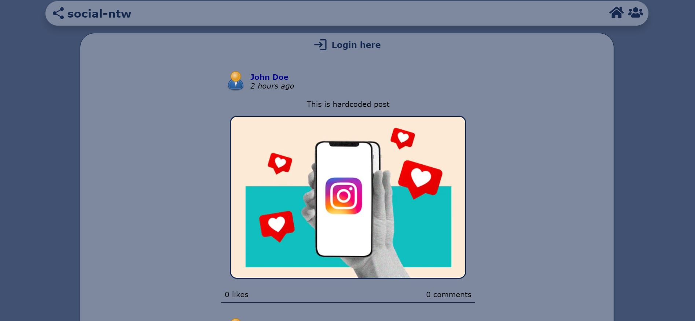
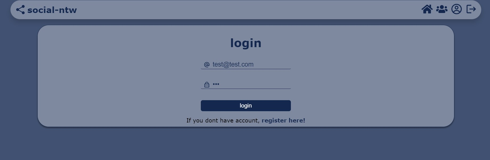
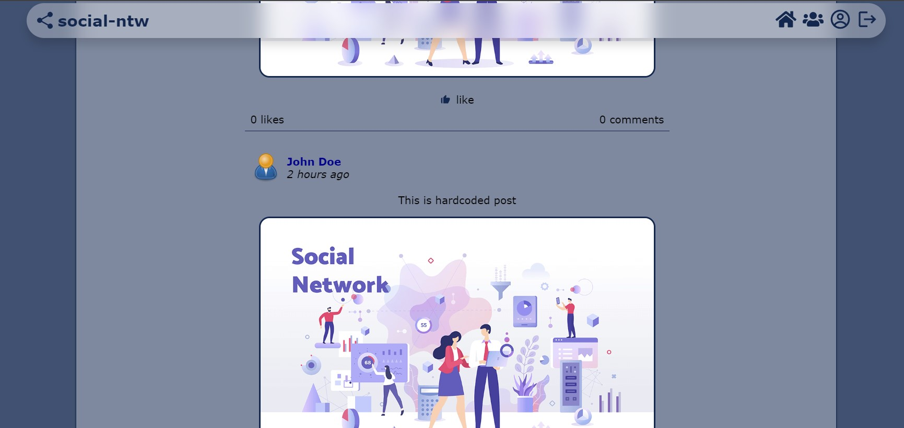
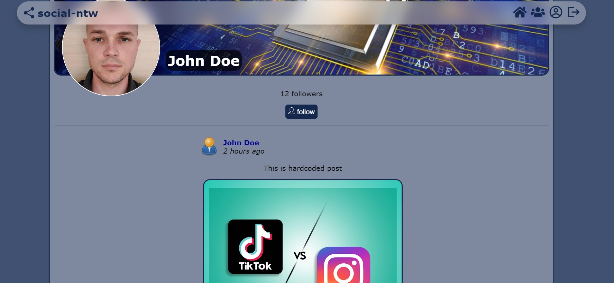

# react-social-ntw

## Demo

For a live demonstration, please visit [Demo Link](https://moonlit-creponne-d409d5.netlify.app/).

## Project Description

This project serves as a demonstration of a responsive design implemented using a combination of **React**, **TypeScript**, and **Vite** for the client-side (frontend). Notably, the responsive layout is achieved through the use of **pure CSS**. The interface is currently in the early stages of development, with a focus on achieving a basic layout.

The server-side (backend) is planned to be constructed using **Firebase** for backend services. However, as of now, the server implementation is pending.

## Screenshots

Below are screenshots of the current state of the user interface:

## Note

This application is a demo with non-functional React components containing hardcoded data. The primary purpose is to showcase a responsive design built using **CSS**. Future development plans include implementing dynamic functionality.

Feel free to explore the demo and provide feedback on the design and layout.